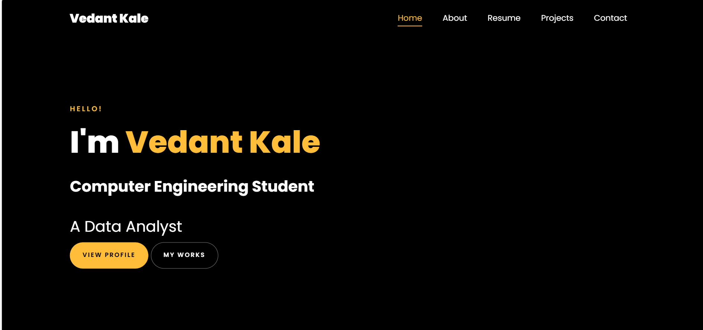
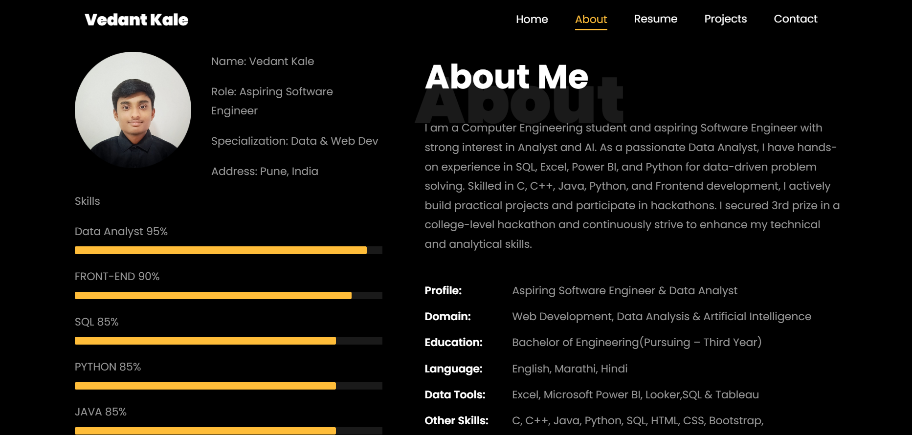
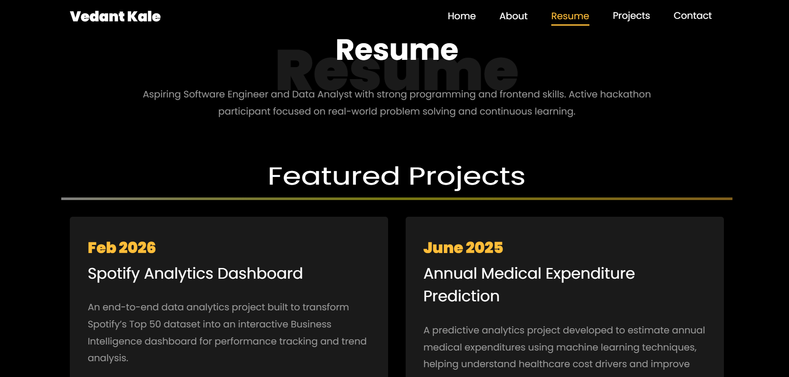
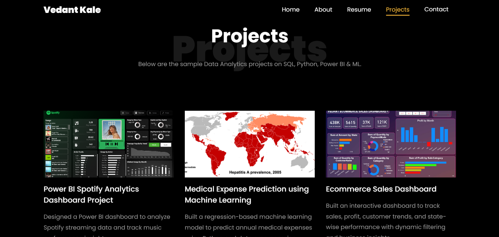
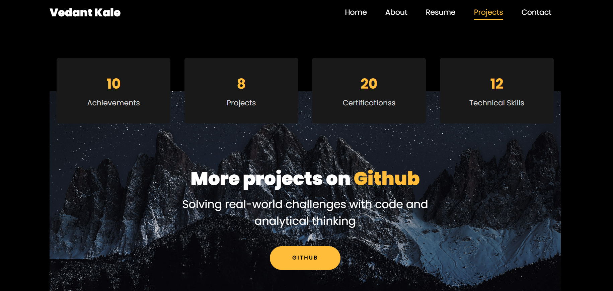
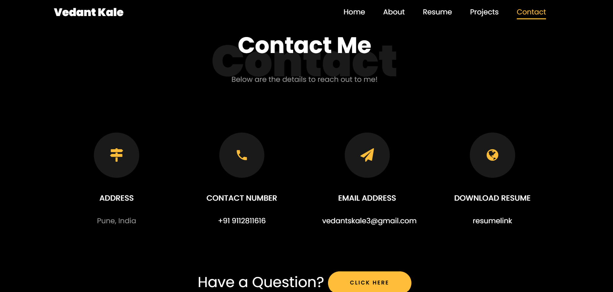

💼 Vedant Kale – Portfolio Website

📌 Project Overview

This is my personal developer portfolio website designed to showcase my projects, technical skills, achievements, certifications, and contact details.
The portfolio highlights my work in Data Analytics, Machine Learning, and Web Development, presenting my projects through a clean, responsive, and interactive user interface.
It serves as a central hub for recruiters, collaborators, and professionals to explore my technical journey and practical work.

🛠 Tools & Technologies Used

- HTML5 (Structure)
- CSS3 (Styling & Animations)
- Bootstrap (Responsive Layout)
- JavaScript (Interactive Features & Typing Animation)
- jQuery (UI Enhancements)
- Font Awesome (Icons)
- Owl Carousel (Slider Animation)

🌐 Website Sections
1️⃣ Home Section
- Animated typing introduction
- Quick links to LinkedIn and GitHub
- Professional branding

2️⃣ About Section
- Profile summary
- Skills with progress indicators
- Technical expertise overview
- Hackathon achievements

3️⃣ Resume Section
- Featured Projects
- Education details
- Downloadable CV

4️⃣ Projects Section
- Highlighted projects include:

🎵 Spotify Analytics Dashboard

🏥 Medical Expense Prediction (Machine Learning)

📊 Ecommerce Sales Dashboard

Each project includes:
- Description
- GitHub repository link
- Visual preview

5️⃣ Contact Section
- Email & Phone details
- Resume link
- LinkedIn, GitHub & LeetCode profiles
- Contact Form Integration

🚀 Key Features
- Responsive Design (Mobile + Desktop Friendly)
- Smooth Scroll Navigation
- Typing Text Animation
- Animated Skill Bars
- Project Hover Zoom Effects
- Clean & Professional UI

📂 Repository Structure
Vedant-Portfolio
│
├── index.html
├── css/
├── js/
├── images/
├── README.md
└── assets/

## 📸 Portfolio Preview

### 🏠 Home Section

### 👤 About Section

### 📄 Resume Section

### 💼 Projects Section

### 💼 Projects Section

### 📞 Contact Section

🎯 Purpose
This portfolio demonstrates:
✔ Data Analytics Expertise

✔ Machine Learning Projects

✔ Frontend Development Skills

✔ Real-world Project Experience

✔ Hackathon Participation

📌 How to Use
Step 1: Clone the repository

Step 2: Open index.html in your browser

Step 3: Customize content if needed

Step 4: Deploy using GitHub Pages

🌍 Live Website
https://vedantkale3.github.io/portfolio/

👨‍💻 Author

Name: Vedant Kale

GitHub: https://github.com/Vedantkale3

LinkedIn: https://www.linkedin.com/in/vedant-kale-b75419292

⭐ If you like this portfolio, feel free to star the repository!

